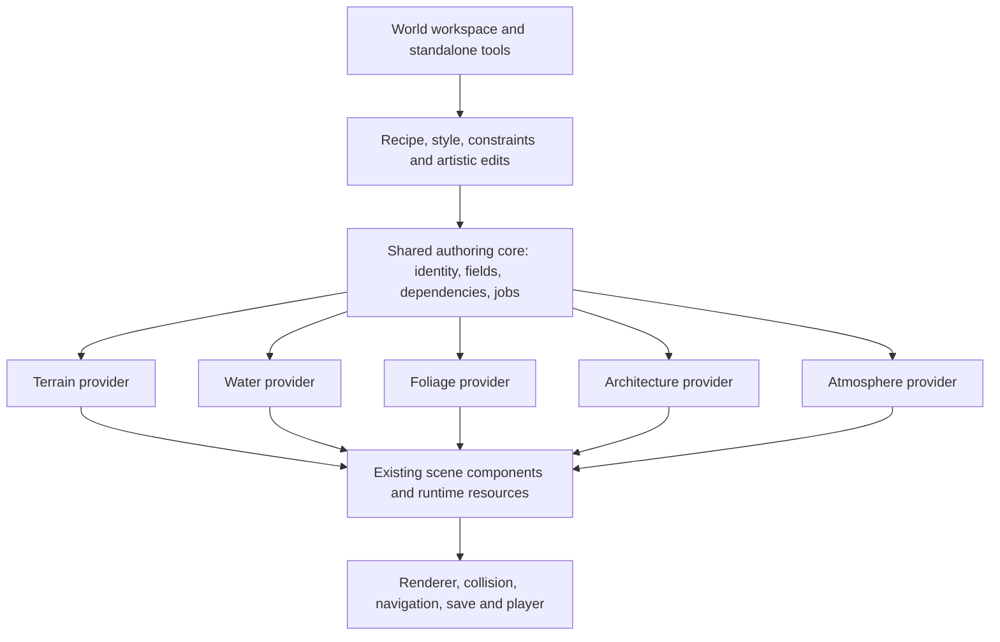

# World: architecture and implementation plan

Date: 2026-09-12. Status: architecture proposal with Phase 0 prototypes underway. See [the Phase 0 evidence and remaining gates](WORLD_PHASE0.md); the production World module is not yet implemented.

First acceptance environment, selected by the owner: **temperate valley with forest, river, lake and village**.

## 1. Product decision

World is the engine's unified world-authoring module. It composes Terrain, Water, Foliage, Architecture and Atmosphere, which remain independently available. The common foundation is a procedural document with persistent artistic edits, shared spatial relationships and replaceable style resources. The existing modules become providers of that foundation, rather than five tools hidden behind one button.

The experience must work in both directions:

1. Generate a landscape with a coherent finished appearance, then reshape, repaint, remove, replace and hand-place anything.
2. Start by drawing a river, sculpting a hill or placing a cottage, then ask generation to complete the surroundings while respecting that work.
3. Change the recipe or visual style later without discarding authored decisions.

A successful default produces believable landforms, finished surfaces, vegetation communities, detailed structures, lighting and usable collision. More noise, more scattered objects and a different color palette are insufficient. The screenshot motivating this project is the visual baseline to surpass, not a target for the new generator.

The owner's later realistic nature reference raises the visual target: layered mature crowns with overlapping foliage, varied understory, irregular banks mixing plants, soil and rock, and water with credible depth, reflection and lighting. Judge these together at walking height as well as in landscape views. The current foliage and cottage work is an incremental Phase 0 study; it has not completed this visual target.

“Full control” means every procedural decision has a resource, parameter, rule, local override or conversion path. It does not mean one universal algorithm can invent every possible architectural tradition, ecosystem or art direction. The built-in generators provide strong editable families; custom materials, species, construction kits, prefabs and generator extensions provide the open-ended path.

## 2. What is already available

These findings describe the checked-out source, not promises about the proposed system.

| Area | Reuse | Required change |
| --- | --- | --- |
| Terrain | CPU height/splat data, sculpt/paint tools, four PBR overlay layers including material graphs, model/entity scatter, surface revisions and dirty rectangles | Chunked generation and LOD; geological landforms; persistent generator-relative edits; biome/material fields; consistent surface API |
| Water | FFT waves, foam, appearance controls, physical volume queries, buoyancy, underwater/caustic rendering | Polygon lakes, spline rivers, sloping flow, connected hydrology and scalable shared domains |
| Foliage | Procedural branch growth, leaf alpha masks and surface detail, deterministic surface scatter, attachment/reseating, instancing, LOD/impostors, scene wind | Species resources and multiple prototypes, ecological distribution, shrubs/ferns/reeds/deadwood, paint/erase and per-instance overrides |
| Architecture | Direct form drawing, openings, paths, supports, editable assemblies, recipe generation, terrain following, collision and GI room integration | Preserve edits to generated features; richer shapes, roofs and junction rules; finished detail grammar; shared role materials and style resources |
| Atmosphere | Sun/moon, time, weather, clouds, precipitation, scene wind, wet/snow surfaces, environment lighting | Expose the same style/climate workflow; explicit environment ownership; authored appearance resources and richer cloud/season profiles |
| Editor/runtime | Command bus, serialization, prefab machinery, material graph/assets, module catalog, export/player | World documents/resources and asset discovery, dependency lifecycle, one workspace and source-aware commands |

### Important limits discovered in the audit

- Terrain is currently a single square heightfield. Its local “erode” brush is a neighborhood operation, not a drainage/erosion simulation. Increasing its size does not create a scalable world system.
- Terrain has four splat overlay channels. Arbitrarily adding biome buffers or material samplers to every shader is not a viable generalization.
- Foliage exposes five species categories and one prototype per component. Its instance list is derived runtime data. Changing distribution has no durable per-instance edit contract.
- Foliage directly calls Architecture's exclusion service. This relationship belongs in a shared spatial contract.
- Architecture has two useful representations. Recipe generation replaces its owned branch, preserving separate authored additions but **not edits to generated pieces**. The connected form model stores editable forms and openings, but its current shape/roof vocabulary and color-based material path are limited. Both must be accounted for in migration.
- Water's analytic domains are primitive shapes. `MAX_WATER_SLOTS = 2` in `src/engine/vfx/waterSlots.js` limits shared underwater/caustic participation; extra surfaces can still render, so a superficially successful river made of many surfaces would conceal incomplete integration.
- Module enablement currently has no declarative dependencies, pending-enable deduplication or dependency ownership. `applyEngineModules` reconciles an exact ID set. Enabling child modules opportunistically inside World's setup would be fragile.
- Atmosphere writes scene-global state. Multiple World roots must not independently compete for the sky, wind or primary directional light.

## 3. First complete experience

The initial World workspace opens onto the existing viewport. The author chooses a recipe, extent, seed and style, with optional village generation. The default is the temperate valley. Generation produces a visible, navigable landscape and a concise progress indicator; the camera remains usable.

The primary tools are **Shape, Water, Paint, Grow, Build, Paths and Select**. Names describe actions, not engine internals. Clicking a result exposes contextual handles and a small set of useful controls; the inspector provides the full parameter groups. A searchable advanced view exposes every supported parameter without putting hundreds of sliders in the initial flow.

Examples of the intended interaction:

- Draw a river: preview channel and banks; commit creates water, wet shore material and suitable bank vegetation together.
- Widen a lake: its shore, reeds and nearby procedural planting respond; pinned objects retain their authored placements and show any new conflicts.
- Paint forest: density and species weights change within the brush area. Erasing a clearing records an exclusion so regeneration cannot refill it.
- Place or grow a cottage: roofs, corners, openings, foundations and detail respond to the shape and selected construction style.
- Draw a path across a wall: the relationship proposes an opening according to the building rules. The author can change it, pin it or turn automatic adaptation off.
- Draw a road across water: preview grade, crossing span and a compatible bridge; reject infeasible routes with an actionable indication.
- Recolor one roof, move one tree and sculpt a hill; regenerate vegetation and change the regional style. All three local decisions survive.

Gestures use the existing editor input conventions, snapping, selection, cancellation and command bus. One completed stroke is one undo action. Expensive finalization runs on commit; previews have bounded cost. World must not introduce a second undo stack or interfere with geometry editing's simulation suspension.

## 4. Shared architecture

### Module responsibilities



Proposed locations, not files that already exist:

| Location | Responsibility |
| --- | --- |
| `src/engine/world/` | Small renderer-independent document, identity, dependency, field and generation contracts; no React, Tauri or imports of concrete modules |
| `src/modules/world/` | World definition/component, recipe orchestration, default biome/style resources and cross-provider planning |
| `src/modules/<domain>/worldProvider.js` | Adapt each standalone module to the common contracts; domain algorithms remain with their module |
| `src/editor/world/` | Workspace, contextual tools, document commands, resource editors and authoring previews |
| `src/editor/api/ops/world.js` | Automation operations using those same commands and documents |
| `tests/world-*.test.mjs` and `scripts/world-*.html` | Document, generation, lifecycle, GPU, editor and export gates |

Shared core services are acquired per engine and released with their users. Standalone Terrain or Foliage uses these services without enabling World. World composes providers; it does not duplicate their renderer, physics or asset ownership.

World component disable suspends generation and deactivates its owned render/collision products while preserving the document and edits. Re-enable restores or reevaluates valid products. Deletion or scene unload cancels jobs, removes owned output and releases resources. Disabling the World module leaves authored data inert and recoverable. Adopted standalone objects retain their previous ownership record: releasing adoption restores them rather than deleting them. A module dependency is not itself a claim of ownership over every existing component of that type.

Environment ownership uses a live per-scene owner registry with deterministic active-owner selection. Removing owners out of order must never restore a snapshot from an already deleted owner. Tests cover component disable, module disable, root deletion, additive unload and renderer disposal separately.

Do not move all five implementations into the engine. Move genuinely shared contracts and spatial utilities, keeping compatibility exports where existing callers depend on old paths. The current Terrain import of editor brush math should become a dependency on a neutral brush utility when adapting that code.

### Provider contract

Each provider declares its version, input/output kinds, dependencies, resource references, supported edit operations and quality estimates. Its implementation separates:

1. **Validate:** identify unsupported inputs, unresolved references and invalid combinations before mutations.
2. **Plan:** derive semantic features and affected bounds from immutable inputs; return warnings and work estimates.
3. **Evaluate:** calculate fields, geometry or placement data in cancellable jobs.
4. **Commit:** publish an internally consistent result on the main thread, with generation-token checks and rollback/disposal rules.
5. **Query:** expose spatial fields, stable features and attachment targets to other providers.
6. **Bake/release:** package runtime products and release owned resources safely.

A provider can expose domain-specific tools; sameness means consistent ownership, editing, lifecycle and interoperation, not identical algorithms or identical inspectors. Terrain stays a surface, a river stays a route/domain, a building stays a semantic assembly and weather stays time-varying state.

### Module dependencies

Introduce declarative `requires` and `optional` metadata, resolve a dependency graph before setup, reject cycles, deduplicate concurrent enables and roll back failed setup. Track explicit project choices separately from dependency leases. Disabling World releases its leases while preserving modules explicitly enabled by the author; removing a still-required provider is refused with the dependent feature named.

World requires Terrain, Water, Foliage, Architecture and Atmosphere for its complete default recipe. Physics and Navigation remain optional capabilities: a playable template enables them deliberately, while an art-only scene can omit them. The UI reports what “Jump in” requires.

Project persistence stores explicit module choices; exports include the resolved closure needed by their scene content. Old flat module lists remain valid. This work must also address the existing global component registry when multiple engines use the same component type; one engine releasing a module must not unregister a type still in use elsewhere.

## 5. The document is the source of truth

Conceptually:

**Resolved world = evaluate(recipe + authored constraints + style resources), then apply local edits and authored additions.**

Edits that influence generation enter at a declared stage: a river control point changes hydrology, a terrain stamp changes elevation before planting, and a roof paint override resolves at material assignment. A single final overlay pass cannot express all these relationships correctly.

Proposed resources:

| Resource | Stores |
| --- | --- |
| `.world` | Versioned recipe, extent, seed namespaces, resource references, regions, paths, constraints, edit layers and persistent feature identities |
| `.worldstyle` | Material roles, form/detail rules, vegetation appearance, weather/look profiles and overrides |
| `.biome` | Environmental suitability, species mixtures, ground/rock roles, clustering, seasonal behavior and density ranges |
| `.species` | Growth family and parameters, variant distribution, leaf/bark resources, LOD and wind response |
| `.construction` | Building/road/bridge grammar, compatible joints, semantic sockets, dimensions, details, material roles and collision rules |
| `.geology` | Rock family, strata/fracture controls, cliff transitions, debris distribution and surface roles |

Use existing asset mechanisms and `.mat`/prefab references within these documents. Final extensions can follow repository asset conventions during implementation; the separation of responsibilities is the requirement. Default resources must ship locally and be duplicable/editable. First generation must not depend on an account, a download or a paid asset service.

The World component stores its document reference and instance-specific overrides, not millions of duplicated authored entity records. A scene-owned instance has its own persistent ID namespace even when two instances share a recipe. Generated render data is a cache, never the sole copy of authored work.

The first implementation should support a versioned embedded document to exercise undo and scene round trips, then promote it through the asset pipeline before release. Migration must preserve IDs and edits exactly.

Illustrative document shape (proposed format, not an implemented API):

```json
{
  "version": 1,
  "id": "valley-document",
  "generatorVersions": { "terrain": 1, "hydrology": 1, "settlement": 1 },
  "recipe": "temperate-valley",
  "seed": 1842,
  "extent": { "width": 1000, "depth": 1000 },
  "style": "World/Styles/NaturalTemperate.worldstyle",
  "biomes": ["World/Biomes/Meadow.biome", "World/Biomes/MixedForest.biome"],
  "settings": { "relief": 80, "forestCover": 0.55, "village": true },
  "regions": [],
  "constraints": [],
  "editLayers": [
    { "id": "art-pass", "enabled": true, "operations": [
      { "id": "roof-color", "kind": "override", "target": "village/lot-a/house/roof", "property": "tint", "value": "#79594d" },
      { "id": "keep-oak", "kind": "pin", "target": "forest/cell-3-8/candidate-72", "aspects": ["placement"] }
    ] }
  ],
  "authoredFeatures": [],
  "orphanEdits": []
}
```

Those target keys refer to persistent semantic features, not inferred name paths or hierarchy indices. Feature records and generator lineage retain their identity mapping. Large field edits live in referenced chunk assets rather than enormous JSON arrays. Validation enforces finite values, resource types, unique IDs, explicit operation ordering and version migrations before jobs start.

### Identity and random variation

- Each authored feature has a durable ID independent of entity allocation order.
- Generated IDs derive from persistent feature keys, provider namespace, spatial cell and candidate key. They do not derive from mutable array indices or current vertex numbers.
- Random values derive from separate streams for terrain, hydrology, placement, geometry and appearance. Changing leaf tint must not reshuffle the forest; adding flowers must not move houses.
- Candidate populations use stable ranked candidates so changing density accepts more or fewer candidates without rerolling all survivors. Chunk boundaries use deterministic ownership and neighbor checks.
- Seed changes that truly replace topology cannot guarantee feature correspondence. Preserve unmatched edits in an orphan collection and retain a visible authored snapshot where required; never silently apply an old roof override to a different house.
- Generator and resource versions participate in cache keys. Existing documents retain their pinned interpretation until an explicit migration/rebase, with undo and diagnostics.

### Persistent edit operations

| Operation | Meaning on regeneration |
| --- | --- |
| Property override | Local dimension, material, color or variation wins over inherited defaults |
| Transform override | Move/rotate/scale a feature with explicit world or attachment-relative anchoring |
| Delete/suppress | Tombstone a feature or paint an exclusion region so generation does not restore it |
| Add | Preserve an authored feature, imported asset or assembly independent of generated population |
| Pin | Freeze selected aspects, such as position, outline or complete resolved appearance |
| Sculpt/paint | Replay a versioned stamp or sparse field edit at its declared stage and coordinate space |
| Replace | Keep identity/attachment while substituting a species, construction resource, prefab or material |
| Make independent | Convert selected output to ordinary editable assets/entities, explicitly leaving procedural ownership; record suppression so regeneration does not create a duplicate |
| Reset override | Restore inheritance for selected properties or regions; never reset unrelated edits |

Terrain distinguishes additive displacement from absolute-height flattening and masking. A “raise 2 m” edit can follow a new base; “flatten to 12 m” remains an absolute constraint. Resolution changes resample spatial edits using documented interpolation, with baseline comparison tests. Importing an existing heightmap may create a base layer rather than pretending its sculpt history is known.

For vegetation, store stable instance IDs and attachment semantics rather than one entity per grass blade. A hand-moved plant can follow the surface with an offset or remain fixed in world space. An edited plant excluded by a new biome remains authored and can show a suitability warning. Automatically generated, unpinned vegetation may be removed by new constraints.

Building openings attach to semantic wall/facade coordinates. A topology edit remaps compatible anchors; a deleted wall creates a resolvable orphan rather than moving the opening to an arbitrary triangle. Existing imported geometry cannot regain an invented procedural history: adopt it as an authored asset, surface or construction-kit part.

### Conflict policy

Authored pins and explicit local overrides take precedence over automatic aesthetic rules. Hard invalidity, such as a collapsed bridge span or missing material asset, is reported instead of silently ignored. The editor offers retarget, keep as authored, reset override or inspect the conflict. A conflict does not authorize deleting the user's work.

World commands are the shared entry point for inspector edits, viewport gestures, scripts and MCP. Direct edits through an existing standalone inspector must be translated to source-document edits for managed output. Avoid two independent values where the inspector changes component props and the next World refresh overwrites them.

Mutation and evaluation primitives live in the neutral core. Editor commands wrap them for undo; editor scripts and MCP use those wrappers. Gameplay changes use transient runtime overrides by default and restore on Stop, consistent with the engine's existing authored/effective property distinction. Persisting runtime changes requires an explicit authoring operation or a game save document; ordinary gameplay `setProp` must not rewrite the source asset. The player never imports the editor command bus.

## 6. Spatial relationships and generation order

### Shared fields and surfaces

Use world-space metres, Y-up, explicit transforms and units. Every provider exposes bounds and revisions. The field vocabulary includes elevation, normal/slope, curvature, soil, substrate, moisture, climate temperature, biome weights, water depth, shoreline distance, flow direction, occupancy and exclusions.

Continuous fields have a declared resolution, interpolation, coordinate transform, validity bounds and revision. Queries outside coverage return no sample; they must not invent zero-height ground. Exact collision/placement queries use the rendered surface or an explicitly bounded approximation. Promote the transform-aware triangle sampling and dirty-bound work in `architecture/terrainSurface.js`; do not replace it with a naive untransformed heightmap lookup.

Shared spline/polygon resources represent rivers, roads, walls, planting boundaries and lake shores with domain-specific attributes. All tools use the same editing handles, snapping, bounds/revision notifications and undo semantics.

Static climate and soil fields drive generation. Current weather drives runtime appearance and motion. A rain shower changes wetness and wind without respawning a forest or re-solving the entire terrain.

### Dependency order

1. Read authored layout constraints, pinned features and recipe/style references.
2. Generate coarse geology and base elevation, incorporating intentional terrain constraints.
3. Solve drainage, lakes and river courses; derive channel/shore edits and hydrological fields.
4. Classify soil and biome suitability; plan settlement zones and routes against slope, water and exclusions.
5. Apply bounded road cuts, building pads and bridge foundations; update affected surfaces and water checks.
6. Resolve ground materials, exposed cliffs and rock/debris placement.
7. Place building masses and resolve their construction details.
8. Populate vegetation using final terrain, water, roads, footprints and authored masks.
9. Apply the scene's chosen atmosphere/style state and finalize collision, navigation and render caches.

Hydrology and road grading can affect each other. Use explicit staged dependencies and a bounded repair/validation pass, not event listeners that repeatedly invalidate one another. If a road would dam a river, generate an allowed crossing/drainage solution or report an unresolved route. Buildings are not repeatedly raised while roads are repeatedly cut beneath them.

Edits invalidate only their declared outputs and spatial dependents. Use dirty bounds plus a provider-specific influence margin; hydrology can require an upstream/downstream catchment beyond the brush footprint. Style properties declare an invalidation class: appearance only; geometry with collision/attachment repair; population placement; or layout/hydrology. Recoloring preserves placement, but changing roof proportions must revalidate openings and foundations, and changing a spacing rule legitimately updates its unpinned population. Time-of-day edits do not rerun geometry generation.

## 7. Finished landscape generation

### Terrain and geology

Start with controllable ridges, valleys, shelves, basin shapes and domain-warped detail, with bounded erosion/sediment passes. Preserve useful author controls: relief, valley width, ridge direction, slope character, erosion strength, rock exposure, soil depth and water table. A declared drainage algorithm establishes downhill flow and outlets; carved channels must agree with that network.

Use heightfield chunks for the broad surface and mesh-based cliff/rock features for overhangs, broken strata and large silhouette detail. A heightfield cannot represent caves or vertical overhangs; those require supplemental geometry. Complete cave/tunnel networks are a later extension, not silently promised by a “cliff” slider.

Ground materials derive from slope, geology, moisture, vegetation and authored paint. Provide world-scale UVs/triplanar treatment where appropriate, normal and roughness detail, macro color variation and controlled transitions between soil, grass, gravel, wet banks and exposed rock. Snow/wetness remain compatible with Atmosphere.

Extend beyond four artistic roles through a bounded per-chunk material palette and packed weight textures, with validation when a chunk exceeds its supported palette. Select an implementation after shader/performance trials; do not bind one material graph per biome across the whole world. Preserve the existing four-overlay Terrain path for old scenes.

Rock generators need controllable strata, fracture direction, angularity, rounding, scale distribution and lichen/moss placement. Reuse a bounded library of procedural prototypes through instancing; avoid independently unique high-detail geometry for every pebble.

### Water and hydrology

Represent a connected water network with lakes as bounded basins and rivers as directed spline reaches. A reach owns width, bed profile, surface elevation/grade, flow and bank transitions. Lake levels and river endpoints agree; uphill segments, disconnected wet polygons and uncontrolled terrain intersections fail validation.

Reuse Water's shading and interaction where compatible, adding a common arbitrary-domain query used by rendering, buoyancy, underwater effects, shoreline foam and GI. CPU and GPU must agree about the same water body.

Replace the assumption of a slot per independent primitive with stable shared domain/field resources and a bounded pool of local high-detail interaction windows. Distant water can use cheaper dynamics, but remains the correct visible and physical body. Packed sampled textures/domain tables are preferred over an ever-growing set of shader bindings. The two-slot limitation must be resolved or explicitly bounded before accepting a world with multiple water bodies; silently losing underwater/caustic behavior is a failure.

A first river can use baked flow direction and procedural surface motion with local ripples. Full real-time watershed fluid simulation is unnecessary for world creation. Do not market visual flow as a physical fluid simulation. Flooding and erosion during gameplay are separate future systems.

### Biomes and vegetation

A biome is a blendable environmental rule set, not just a color label. The valley starts with meadow, mixed deciduous forest, conifer slope, riparian/wetland and rocky upland communities. These can share species and vary weights continuously; a brush can override their suitability.

Species resources expose crown envelope, age/vigor, trunk taper, branching family, branch angle/length/levels, leaf shape/size/density, bark/leaf material and wind response. Shrubs, ferns, reeds, ground plants and deadwood extend the current five-category catalog. Imported plant assets can occupy the same placement/variation roles.

Each population selects from a bounded set of seeded prototypes with age, topology, size and appearance variation. Spatial clustering, canopy competition, edge conditions, clearings and understory layering create communities. Changing a color uses material paths where possible; it should not unnecessarily repeat branch growth or scatter.

World and standalone Foliage share one placement/painting contract. Terrain's imported model scatter remains a supported rendering backend and adopts the same persistent masks, candidate IDs and overrides. Existing barycentric reseating remains useful when topology is unchanged; persistent spatial/semantic anchors handle regenerated topology.

### Atmosphere and seasons

Retain the existing physical sky/weather system and its direct response to changing sun direction. A style can configure sky palette behavior, cloud form/profile, haze, exposure/postprocess suggestions and seasonal vegetation/material responses. Appearance changes must affect both the visible sky and the environment lighting coherently.

One explicit environment owner drives scene-wide sky, wind and sun. Multiple World roots may provide local climate/biome fields, but only the active environment owns globals; additive loading and disabling it restore the previous owner predictably. Local fog/weather volumes are later extensions with explicit blending.

Do not solve style changes by silently replacing the user's camera/postprocess setup. Apply look resources to World-owned settings or offer explicit adoption for existing settings.

**Deferred at the owner's request:** realistic sky, clouds and weather remain required, but their visual quality upgrade comes later. Continue using the existing Atmosphere during the current foliage/world studies. The later pass should address believable sky gradients and horizon haze, clouds with depth, irregular forms and coherent lighting, and weather transitions that agree across sky, sunlight, wind and wet/snow surfaces; expose their appearance through the same editable style resources.

That later pass requires fixed-camera clear, overcast, low-sun and changing-weather comparisons against the nature target. Visible sky, reflections, environment lighting and cloud shadows must agree, moving sunlight must respond immediately, and the review must include measured whole-frame CPU/GPU cost. These are planned acceptance gates, not claims about the current implementation.

## 8. Finished architecture and infrastructure

The architecture core already supports direct shape editing. Extend it with semantic construction layers:

1. **Layout:** lots, building footprints, connected masses, intended access and optional interior needs.
2. **Structure:** foundations, walls, roof systems, floors and load-bearing visual rules.
3. **Openings and connections:** doors, windows, arches, stairs, porches and junctions.
4. **Finish:** eaves, roof thickness/tiles, ridges, sills, lintels, frames, shutters, trim and material transitions.
5. **Dressing:** gutters, chimneys, vines, planters and context-sensitive clutter, with independent density and exclusions.

These are semantic data layers, not a requirement for one entity per brick. Merge compatible generated detail within editable chunks; preserve feature IDs for picking and overrides. Geometry edits must retain the existing no-stale-batch behavior. Establish explicit stable-output batching before enabling it for settled models.

Construction resources encode compatible roof/wall profiles, corner/junction treatments, palettes, dimensions and feature placement rules. Include complete default resources rather than only a framework for users to author them. Realistic and stylized styles require different silhouette, proportions, surface detail and ornament choices, not only shader changes.

The first village needs a small coherent family of genuinely different cottages/outbuildings, meaningful roof variations, paths, a road, fences and one bridge family. Building style controls include proportions, roof pitch/overhang, opening rhythm, symmetry, foundation treatment, detail density, material aging and ornament. Subsequent families broaden the architectural vocabulary.

Roads own centerlines, widths, cross-sections, grade limits, junctions, shoulders and surface roles. Terrain adapts through a reversible corridor edit. Lots face access routes and respect water/slope/setbacks; bridges own abutments, deck clearance, approaches and optional piers. Check walking continuity and collision rather than judging them only from above.

Buildings can be exterior-only or have generated interiors. The first valley requires solid terrain, traversable roads/bridge and correct collision/openings; arbitrary furnished interiors, utilities and simulation of towns are separate later scope. The workspace must label exterior-only buildings rather than implying all generated houses can be entered.

## 9. Style system and artistic depth

Separate **world logic**, **visual style** and **runtime quality**. A new style must not relocate the village unless it explicitly changes a layout rule. Reducing runtime quality must not change authored placements or game collision unexpectedly.

Style inheritance resolves from base style to region/biome, feature family, instance and local edit. Missing properties inherit; resetting removes an override. Resource updates show their affected instances and preserve local changes. Limit/cycle-check resource inheritance.

| Control group | Examples |
| --- | --- |
| Shape language | Softness/angularity, proportions, deformation, asymmetry, silhouette exaggeration |
| Material roles | Soil, wet soil, gravel, strata, bark, leaves, plaster, timber, roof, road, bridge |
| Surface response | Roughness, normals, displacement where supported, translucency, wet/snow response |
| Detail rules | Roof tiles, trim dimensions, branch density, strata scale, clutter and aging |
| Variation | Ranges, distributions, correlated palettes, prototype weights and local seeds |
| Climate/look | Season, cloud profile, haze, sky behavior and lighting settings |
| Placement | Density, spacing, slope/altitude ranges, habitat preference, clustering and exclusions |

Ship at least two complete treatments of the same valley for the first style acceptance: naturalistic temperate and deliberately stylized countryside. They share the authored plan but differ in geometry and surface treatment. This demonstrates the system is not tied to a single fixed visual design.

Curated procedural materials and well-made default resources are part of implementation work. The existing asset libraries can enrich a style, but World must work offline out of the box. Any externally sourced default assets require recorded provenance and redistribution rights. Custom shader/asset choices may exceed a target performance tier; report cost instead of silently changing their design.

An advanced graph/rule editor can follow the resource and provider contracts. The first release should expose structured resource editors and documented generator extension points; building a universal visual language before proving the valley would delay the actual world tool.

## 10. Performance, persistence and runtime delivery

### Targets to measure, not current claims

The initial integration fixture can be 512 m square. The first complete acceptance scene is **1 km by 1 km**, with detailed near terrain, streamed/chunked distant content and a clearly defined quality profile. A separate multi-kilometre stress fixture verifies scaling after the valley works.

Provisional desktop acceptance targets, to calibrate against a recorded reference machine in Phase 0:

| Measurement | Proposed target |
| --- | --- |
| Warm default 1 km valley generation, locally available resources | Finished configured generation within 10 s |
| Cold generation including required shader/resource preparation | Within 20 s; record separately from warm results |
| Immediate brush/handle feedback | Within the next rendered frame where possible; p95 under 50 ms |
| Local committed edit affecting a small region | p95 under 250 ms after warm-up; costly watershed/topology edits report progress |
| Runtime at 1920×1080 on the agreed desktop tier | Whole-frame p95 at or below 16.7 ms on the prescribed walking route |
| Resource lifecycle | Stable retained memory after repeated generate/undo/reload cycles, within an explicitly recorded cache budget |

The timing ends when the declared scene detail, materials and collision are ready. A cheap preview or placeholders do not count as finished generation. Record first preview, first playable area and full completion separately, plus outstanding background jobs. Do not quietly loosen these targets if measurements fail; revise scope/implementation and document the decision.

A “large world in seconds” claim must include extent, density, detail distance, hardware, cache state and what is ready. The 120 FPS screenshot is not a budget for a more detailed scene. Mobile uses the existing platform/quality system and needs its own measured profiles.

### Work scheduling

- Run pure field, placement and geometry preparation in workers using transferable arrays and cancellation tokens.
- Use stable chunk coordinates and hierarchical detail. Sampling comes from a common global field with overlap/halo rules to prevent terrain, normal, road and vegetation seams.
- Complete coarse drainage connectivity at world scale; evaluate expensive local detail by chunk. Hydrology cannot be solved independently on isolated tiles without boundary conditions.
- Cache by content hash plus provider version, upstream revision, style and quality. A cache hit must represent a complete valid product.
- Commit coherent affected regions; retain the last complete generation while a replacement builds. This is generation-job continuity, not permission to freeze moving lights or weather.
- Stage resource allocation and dispose superseded/cancelled jobs. Never publish worker output after its owning World has been deleted or a later generation has won.
- Bound main-thread uploads, texture copies, pipeline creation, collision cooking and navigation updates. Worker-only timings hide real user cost.
- Update local collisions on committed geometry before reporting the edited region playable. World streaming must preload collision along the expected movement path.

### Engine invariants to preserve

- Every fully composed GI compute stage stays within eight storage buffers; do not request a device limit of sixteen. Pack shared data or use read-only sampled textures.
- Any GI buffer or TSL sampling change requires the runtime portable-eight WebGPU smoke, not just a Vite build.
- Continuously rotating sun tests measure whole CPU/frame and GPU cost, including classification, traversal, copies and submissions. Changed clipmap projections use one native full render per level and no static-cache capture/copy. Preserve native alpha/deformation and immediate light response.
- Retain foliage's version-driven uploads and settled batch reuse; measure actual queue writes, not only attribute versions.
- Keep generation and shader compilation out of uncontrolled per-frame rebuild loops. One material variation must not accidentally create a unique pipeline per instance.
- Play/Stop restores authored values and platform variants. Generation work is not resumed against disposed resources.

### Save, prefab, build and player

Save recipe/resources and sparse authored edits independently of derived caches. Autosave must not wait for an entire world bake. Undo stores document changes and bounded dirty data, with checkpoints for expensive terrain operations; full copies of every world array on every stroke are unsuitable at scale.

The player defaults to baked, versioned generated products plus required runtime simulation data. Runtime procedural generation is an explicit supported mode using the same deterministic evaluator, not an accidental editor dependency. Building a game traverses every referenced biome/species/style/construction/material/texture/prefab asset, including overrides and inactive platform variants required by export policy.

Call these products the **build cache**, distinct from the authoring action **Make independent**. Export creates derived runtime data without removing procedural ownership or changing the editable source document. Making an individual feature independent is an undoable ownership change and keeps a tombstone in its source population.

Duplicating a World or loading scenes additively remaps instance identities and internal references while retaining resource sharing. A missing optional provider preserves inert authored data. A missing required resource yields a visible error and a recoverable document, not silent deletion.

## 11. Migration and compatibility

Existing scenes continue to render and edit through their current components. Enabling World does not automatically rewrite their data or adopt their atmosphere. Adoption is an explicit undoable editor action.

| Existing content | Adoption behavior |
| --- | --- |
| Terrain height/splat data | Preserve as an authored base surface/material layer; retain scatter and references |
| Standalone Foliage scatter | Import its settings and seed as a population; preserve current placements when requested before adopting new candidate semantics |
| Recipe Architecture | Import settings plus current resolved pieces as the baseline; do not assume edited pieces can be reconstructed from settings alone |
| Connected Architecture model | Preserve form/opening/path IDs and treat current model entries as authored constraints |
| Water | Preserve primitive domains and physical/appearance settings; arbitrary-domain conversion is explicit |
| Atmosphere | Bind the existing instance only when selected as World's environment owner |
| Imported meshes/prefabs | Keep ordinary asset ownership; optionally expose surfaces, exclusions or construction sockets |

New standalone tools use the same documents, edit operations and surface contracts incrementally. They retain old property readers and serialization migrations while old scenes exist. The acceptance test is both directions: edit a World-owned feature in its standalone tool, and use a standalone-authored feature as a World constraint.

## 12. Phased implementation and release gates

No schedule is claimed before the initial performance and visual spikes. Each phase ends with a reviewable artifact and tests; infrastructure milestones are not called the finished World release. Visual resource authoring is a real workstream alongside engineering.

### Phase 0 — Baseline and risky prototypes

Deliverables: fixed-camera valley reference specification, current engine CPU/GPU/cold-start measurements, one finished terrain/shore/tree/building patch, and prototypes for arbitrary water domains and generated-feature override mapping.

Define the exact initial content catalog and reference machine. Photograph/capture the current engine fixtures at ground level as well as aerial view. Record material/geometry complexity and resource costs. Test current sun rotation and the water-domain binding budget early.

Exit: the visual direction is demonstrated in-engine, the core water and edit-identity risks have feasible measured approaches, and the provisional performance targets have an explicit baseline. This avoids building a large wrapper before proving the expected appearance.

Current progress: the isolated 128 m study, persistent-edit resolver and packed water-domain prototype are implemented. [Phase 0 evidence](WORLD_PHASE0.md) distinguishes passed technical checks from the unfinished landscape appearance and production integration; this phase's visual exit gate remains open.

### Phase 1 — Shared documents, ownership and module lifecycle

Implement the common core, versioned document validation, stable IDs/seeds, override/tombstone/pin behavior, generation transactions and dependency-aware module lifecycle. Add one minimal World document/component and provider contract. Adapt one Terrain edit and one Architecture/Foliage feature to prove end-to-end source ownership.

Exit: generate → hand edit → regenerate → undo/redo → save/reload → duplicate preserves IDs, edits and inherited settings; cancelled jobs cannot publish; failed enable cleans up; standalone modules remain usable. Export a minimal fixture containing one generated surface/building feature, one local override and one nested material reference, then load it in the real player. Expand that gate in every later phase; runtime separation and asset closure cannot wait until the release phase. This phase is infrastructure, not a visual release.

### Phase 2 — Terrain, geology and shared spatial fields

Implement chunked heightfield generation/LOD, authored sculpt layers, common surfaces and dirty bounds, geological landforms, bounded material palettes, cliff/rock features and paint tools. Move existing terrain-following/exclusion consumers onto shared queries through adapters.

Exit: a finished-looking terrain patch and a seam-free landscape; cross-chunk sculpt/undo, tilted surface queries and cliff collision pass. Existing architecture follows correctly. Changes invalidate affected areas without whole-world rescans.

### Phase 3 — Connected water and ecological populations

Implement river/lake domains and the water-resource scaling solution, hydrology/shore fields, biome resources, richer species resources, multiple prototypes and shared scatter paint/erase/instance overrides. Integrate water, ground materials and bank vegetation.

Exit: river flows into a lake with correct banks, shore materials, physical queries and underwater behavior; meadow, mixed forest, wetland and rocky slope look distinct at walking height. Regeneration preserves a moved plant and painted clearing. Required WebGPU and foliage/terrain gates pass.

### Phase 4 — Construction quality, roads and village

Extend Architecture's semantic model and style-aware material/detail generation; add the first construction families, road/junction/grade system, terrain pads, bridge approaches and settlement planning. Preserve authored openings and local feature materials through shape changes.

Exit: the valley contains a visually finished village and traversable road/bridge; every approach and door/collider rule in scope works; automatic details follow edits and can be individually overridden. The default result clearly exceeds the supplied blockout baseline.

### Phase 5 — Unified workspace and first complete World release

Ship the World workspace, contextual gestures and full parameter/resource editors, adoption flows, automation operations, the two complete styles, save/export/player support and quality profiles. UI prototypes start in earlier phases; this phase consolidates them rather than delaying all usability work until the end.

Exit: the complete 1 km valley acceptance journey passes, including generated and hand-authored starting workflows, naturalistic/stylized comparison, regeneration preservation, built-player traversal, cold/warm timing and memory retention. Only here is “create a ready-to-use world” an earned release claim.

### Phase 6 — Breadth and larger worlds

Add more biomes/climates, construction cultures, geology and vegetation families, advanced resource/rule graph editing, larger streamed worlds and optional interiors. Add caves, waterfalls, flood dynamics or local weather only as explicit feature increments with their own representation and budgets.

Exit per addition: new content uses the existing authoring contract and remains editable; it does not fork a second workflow or impose one fixed look on the other styles.

The critical engineering path is Phase 1 → shared surfaces/terrain → connected water → ecology/settlement → release integration. Species, material and building-detail work can run in parallel once Phase 1's resource/identity contracts are stable. Avoid parallel changes to the same shader/resource ownership until those contracts settle.

## 13. Acceptance plan

### Required user journey

1. Enable World in a fresh project; select the temperate valley and Generate.
2. Reach a finished playable landscape within the measured target and walk from meadow through forest to lake and village.
3. Sculpt one hillside, widen a river segment, paint a clearing, move one tree, edit a cottage opening and repaint one roof.
4. Change forest density, regenerate the region and switch regional style. Confirm every local decision remains or has an explicit resolvable topology conflict.
5. Undo/redo the operations, save/reopen, duplicate the World, then Play/Stop twice.
6. Export and run the player; repeat the walking route with identical authored content and functioning terrain/bridge collision.
7. Create a second scene manually first, then generate around its pinned river/building; verify the same tools and resources work.

### Visual gates

Use actual engine captures from fixed cameras: aerial composition, meadow at eye height, forest interior, cliff base, river bend, shallow lake shore, cottage facade and bridge approach. Include overcast/noon and low sun; use identical exposure/cameras when comparing changes. Capture both styles on the same layout.

Reject floating roots, water seams, flat or unscaled ground textures, obvious single-tree repetition, featureless roof wedges, missing trim/opening depth, incoherent material palettes, disconnected roads, visible chunk seams and abrupt biome borders. Test near, mid and distant detail under camera motion. Noisy postprocessing or shallow depth of field must not conceal missing geometry/material quality.

Visual quality needs human review against the chosen target; pixel tests alone cannot certify it. Automated captures and structural checks make that review reproducible. The acceptance report distinguishes subjective appearance decisions from measured correctness/performance.

### Proposed new automated gates

| Suite | Failure it must detect |
| --- | --- |
| World documents and identity | Density/style changes reroll unrelated features; duplicate IDs; lost tombstones; stale/orphan overrides applied to new topology |
| World authoring | A standalone inspector edit is overwritten; undo differs after reload; cancelled/superseded jobs publish; failed transactions leave partial children |
| Shared spatial fields | Transform disagreement, out-of-domain false samples, missed dirty regions, tile seams or catchment under-invalidation |
| World hydrology | Uphill reaches, lake/river discontinuity, CPU/GPU water-domain mismatch, third-body medium/caustic failure |
| World ecology | Identical prototype monotony, lost instance edits, seam spacing failures, planting on excluded roads/water |
| World construction | Invalid junctions, lost openings, hovering pads, impassable bridge approaches, generated-detail selection mismatches |
| Module lifecycle | Dependency cycles, concurrent double setup, incomplete rollback, deleting explicitly enabled modules, cross-engine unregister bugs |
| World export/player | Missing nested assets, editor imports in player, wrong additive remaps, mismatched baked/generated content |
| World performance | Hidden background work, per-frame unchanged uploads, excessive submissions, unbounded memory growth, local edits rebuilding the entire world |

Preserve relevant existing gates: `test:terrain-sculpt`, `test:architecture-terrain`, `test:architecture`, `test:foliage`, `test:water`, `test:atmosphere`, `test:variants`, `test:scenes`, and their domain GPU/editor smokes. Use `package.json` as the authoritative command list; some water probes are scripts rather than npm aliases.

After any GI buffer/TSL sampling change, start Vite and run:

```text
node scripts/run-gpu-page.mjs http://127.0.0.1:<port>/scripts/gi-gpu-smoke.html 70000
```

Require `GI-SMOKE PASS` and no WebGPU validation errors. Serialize GPU runs, stop the live engine loop with `profile.gpuIsolation` for external measurements and use a scratch browser profile outside the workspace. Retain full CPU/frame, GPU raster/compute, copies, submission counts, memory and completion receipts. Include a continuously rotating sun and actual walking camera; static-camera cache wins do not satisfy the requirements.

## 14. Integration map for implementation

| Existing files | Planned use |
| --- | --- |
| `src/engine/modules.js`, `src/modules/index.js`, `src/editor/modules.js` | Dependency resolution, lifecycle ownership, World registration and project persistence |
| `src/engine/components/Component.js`, `src/engine/Entity.js` | Preserve ordinary component/variant lifecycle; bind managed component edits to source documents |
| `src/engine/serialize.js`, `src/engine/prefab/`, `src/editor/build/assetRefs.js`, `src/editor/exportGame.js`, `src/player/main.js` | Reference remapping, document serialization, nested asset collection and runtime closure |
| `src/modules/terrain/TerrainComponent.js`, `src/editor/terrainBrush.js`, `src/editor/commands/terrainCommands.js` | Terrain adapter, layered edits, shared brush/surface APIs and scalable undo |
| `src/modules/architecture/terrainSurface.js`, `ArchitectureTerrainSystem.js`, `architectureEnvironment.js` | Promote exact sampling, dirty-bound following and exclusions into reusable contracts |
| `src/modules/foliage/FoliageComponent.js`, `foliageScatter.js`, `foliageLod.js` | Population adapter, persistent candidates/overrides, masks and multiple prototypes |
| `src/modules/foliage/treeGrowth.js`, `foliageGeometry.js`, `foliageSurfaceTexture.js`, `foliageMaterial.js` | Species parameters, new plant families and controlled visual detail |
| `src/engine/components/WaterComponent.js`, `src/engine/vfx/GridSimulationComponent.js`, `src/engine/vfx/waterShape.js`, `waterVolume.js`, `waterSlots.js` | Arbitrary domains, scalable shared resources, physical and visual parity |
| `src/modules/architecture/formModel.js`, `formGeometry.js`, `blueprints.js`, `ArchitectureComponent.js` | Semantic feature IDs, detail grammar and style-aware surfaces |
| `src/editor/architectureBuild.js`, `architectureModelBuild.js`, `architectureSculptTool.js` | Preserve generation edits and expose common direct-authoring commands |
| `src/modules/atmosphere/AtmosphereComponent.js`, `skyModel.js`, `skyNode.js`, `weather.js`, `weatherSurface.js` | Environment ownership, climate/style resources and runtime look coherence |
| Existing domain inspector sections, viewport workspace tools and `src/editor/api/` | Shared resource editors, source-aware commands and automation parity |

Check current file paths and local changes again before implementing: this workspace contains substantial unrelated ongoing engine work. The original planning pass changed documentation only; subsequent Phase 0 implementation is tracked separately below and in [WORLD_PHASE0.md](WORLD_PHASE0.md).

## 15. Reference intent

The owner's references are [Townscaper](https://oskarstalberg.com/Townscaper/) and [Tiny Glade](https://pouncelight.games/): use them as interaction and finished-result benchmarks, not claims about which algorithms they use. The design here is an engine-specific proposal based on the inspected source.

Tiny Glade's current [official modding documentation](https://pouncelight.games/tiny-glade/info/modding/) includes custom clutter and material workflows. The goal for World is broader first-class control of generators and style resources; it does not depend on an absolute claim that the reference games offer no customization.

For foliage, extend the existing implementation's controllable branch-growth approach rather than replacing it with primitive crowns. [Runions, Lane and Prusinkiewicz, 2007](https://algorithmicbotany.org/papers/colonization.egwnp2007.html) describes tree modeling with parameters tied to visible shape and structure; it is one useful foundation, not a complete ecosystem or art-direction solution.

## 16. Decisions recorded

- First-pass deliverable: this detailed architecture and phased implementation plan, as requested by the owner after the initial audit.
- First complete environment: temperate valley, forest, river, lake and village.
- Existing modules remain independently usable; World combines their shared authoring contracts and upgraded domain capabilities.
- Procedural and artistic workflows are interchangeable; local edits have persistent ownership.
- Finished default content and at least two genuinely different style treatments are release requirements.
- The later realistic nature reference sets the canopy, understory, bank, water and lighting target. Foliage/cottage studies remain incremental; the required sky/cloud/weather quality upgrade is explicitly deferred to later work.
- Performance numbers above are proposed acceptance targets, not measurements or delivery guarantees.
- The first documentation pass performed no runtime implementation. The owner's subsequent “continue” started Phase 0; its implementation, validation and remaining gates are tracked in [WORLD_PHASE0.md](WORLD_PHASE0.md).

## 17. Phase 0 bank and surface checkpoint

The 128 m study composes deterministic shared valley fields with native Terrain and Foliage. One water domain drives irregular lake/river boundaries, terrain carving and shore queries; height, moisture, forest, rock, path and slope fields coordinate ground treatment, rock specimens and ten native foliage population layers. Explicit Foliage placements retain the module's existing wind, LOD and impostor paths. The latest bank correction adds a graded floodplain and varied shoulder before recovering the original ridges, replacing the short blend that produced a steep smooth wall. Procedural stone uses interrupted directional bedding rather than a closed cellular paving pattern.

Optional material surfaces use six local CC0 1K albedo/height maps for grass, soil and rock, with 6,716,074 file bytes and a replaceable role-based manifest. Source albedo receives neutral vertex modulation; browser-decoded height supplies artistic bump, not calibrated physical displacement. Natural defaults to materials and Stylized to procedural surfaces; explicit choices persist. Relief, river width, bank width, rockiness and forest coverage join the seed/density controls. Surface detail scale and bump affect terrain in both modes. URL regeneration and cottage edits preserve these settings and any custom roof override.

At this checkpoint, `test:world` passed 55 CPU tests, including nine field and eight ecology tests. The new field checks reject the former steep bank with actual terrain gradients while preserving wet clearance, the cottage pad and outer ridges. The browser confirmed 232 trees, 489 understory plants and 32,815 ground plants; geology was 35,240 triangles in three merged draws with 558 buried foundation vertices. Final Natural/material, Stylized/procedural and landscape functional reports passed with zero errors under `artifacts/world-surfaces-*`. Production build passed, and generic GI smoke passed at the portable eight-storage-buffer limit; the GI fixture explicitly skips SRC traversal counters. These passes and the original single-cottage benchmark remain historical evidence for their source versions.

The current GPU checks compare browser terrain against a separate Node import of the source on disk after a stale Vite module was detected. Material swatches also exposed cached texture reads eliminating soil/stone bump; independent normal-branch sample nodes restore the effect without adding texture resources. Fixed-light bump/scale comparisons, exact normal restoration, source-albedo selection, native population regeneration and live sky-lighting persistence now pass. These are functional correctness gates, not acceptance of the realistic visual target.

The current baseline shares the full landscape and changes only the detailed cottage to basic existing Architecture. Use `artifacts/world-surfaces-before/` for this pass's actual visual before state. [The bank and surface record](WORLD_PHASE0.md#bank-and-surface-follow-up-historical) preserves implementation boundaries, exact controls and final functional receipts.

The realistic nature reference remains unaccepted. Atmosphere's pending native environment refresh now finishes before the main render, fixing black sky lighting after sun edits without changing asynchronous shader policy; its sky/cloud/weather appearance upgrade remains deferred. Phase 0 continues; the full World module, shared authoring transactions, editor lifecycle and complete playable valley release remain the phased work above.

## 18. Current Phase 0 vegetation and navigation checkpoint

The study adds independently configurable tree scale (0.65–1.5, default 1), ground-prototype height (0.5–1.75, default 1) and planting patchiness (0–1, default 0.65). Shape controls preserve candidate membership and roots; patchiness changes coherent density and plant-type groups while retaining surviving IDs and transforms. Ground, shrub, plant-type and rush signals use 7.5 m, 11 m, 6.2 m and 4.4 m sampling scales. Terrain soil also follows the shared bare-patch signal. A low woodland-floor layer makes eleven native Foliage populations, using existing wind, LOD, impostor and shared-batch rendering. Most ground layers extend to 195 m in the 128 m fixture.

Native OrbitControls allow orbit, pan and zoom from any preset. Focused-canvas arrow keys pan, camera buttons restore their view and resize preserves the current pose. Vegetation settings persist with the other URL controls and cottage artistic edits. These are specimen controls, not the planned production World editor or player traversal.

Oak and birch now use four compound twig-card variants, each with 42 small leaves attached to six lateral shoots and their leader. The larger 0.84 × 0.70 m oak and 0.70 × 0.58 m birch cards retain species-scale individual blades and the existing 12,000 / 2,000 / 1,100 triangle limits; distant trees continue through native impostors. Pine and meadow prototype contracts remain unchanged.

The World CPU suite now passes 59 tests, including twelve ecology tests that preserve density/identity/exclusion checks and reject spatially uncorrelated planting using homogeneous fields, actual candidate roots and shuffled negative controls. Foliage passes 76 CPU tests, including actual textured crown-area comparisons against smaller-card controls. Current tree GPU checks pass for three species at near/middle/impostor detail from three matched angles. The landscape browser gate passes actual orbit/zoom/pan image changes, resize/preset restoration, vegetation controls, native placement rendering and preserved artistic roof edits, with zero errors. Native Foliage/surface GPU checks and production build pass; the Foliage runtime retains portable-eight limits and its 60k-plant fixture. Natural/Stylized reports pass the four cottage families and visible roof-edit checks with zero errors. Generic GI reports `GI-SMOKE PASS storage=8` without validation errors; SRC traversal assertions remain explicitly skipped in that fixture. These are functional receipts, with no new performance certification.

Current Natural views show fuller crowns but remain dark and flat, with repeated twig patterns close up and insufficient sky/lighting, bank and rock polish. Visual acceptance remains open. Use `artifacts/world-vegetation-before/` for the before views and [the vegetation checkpoint](WORLD_PHASE0.md#vegetation-and-navigation-follow-up-current) for exact contracts and receipt status. The deferred Atmosphere appearance work and all production phases above remain unchanged.

## 19. Editor integration and procedural layout checkpoint

The owner requested editor integration, then clarified that tuning a fixed valley composition was insufficient: the placement of rivers, lakes, terrain forms, houses and lanes must itself come from generation. This checkpoint supersedes the earlier statement that all production integration remains outside the implementation.

**World is now a registered engine/editor module**, with dependency leases for Terrain, Water, Foliage, Architecture and Atmosphere. **Create → World → Temperate valley** creates one authored World root and ordinary generated provider children. A dedicated inspector stages landscape parameters, changes look/surfaces, selects individual houses for persistent roof edits, and exposes native Terrain brushes and explicit viewport bookmarks. Native orbit/pan/zoom stays available. Ordinary scene save/reload, duplicate and export carry its versioned document and provider cache.

**The default layout is generated, not the fixed study composition.** `worldLayout.js` derives independent basin centres/contours, a connected downhill river route, ridge locations/orientations, dry house sites/orientations/geometry seeds, and connected foot lanes from the seed. Maximum lake/house counts, river meandering and settlement spread are configurable. A constrained grid search avoids wet/steep crossings; the generator can return fewer houses than the maximum when siting/routing would be invalid. Tests compare shape/placement beyond a simple rigid transform and sample actual road grades, wet clearance and pad levels. Two hundred additional extreme-water seeds were checked for domain bounds and levels.

The layout drives native Terrain heights/material masks and Foliage exclusions/placement, plus shared World water/geology/building providers. Individual house moves first resolve into the layout, then refit pads, exclusions and lane endpoints. Drag previews preserve responsiveness; the normal editor transaction boundary schedules one dependent rebuild at commit. Unreachable authored houses retain their pose and report missing lane connectivity. Stable house keys retain local overrides across regeneration, with orphan edits preserved when a seed omits a target.

The former study helpers for cottage geometry, landscape materials/rocks, water appearance, surface assets and the tree depth prepass now re-export shared production implementations. The depth optimization remains restricted to native main-pass raster and withdraws for GI, postprocessing and alternate render contexts. Historical study FPS measurements are not a new editor performance receipt.

Implementation boundaries remain explicit: the grid is 128 m / 256 segments, lanes are ground masks, buildings use the current four-family detailed generator rather than a finished Architecture grammar adapter, and World water appearance is not the complete native simulation/physics adapter. Streaming, biome/style resource editors, dirty-region/worker generation, bridge/road structures, colliders/navigation/interiors and the final realistic nature/atmosphere target remain later phases. See [WORLD_EDITOR.md](WORLD_EDITOR.md) for the current workflow and source contract.

At this checkpoint the full `test:world` suite passes **105 tests**, the module lifecycle suite passes **18 tests**, and the production editor build passes. The real exporter and nested-path player passed asset closure/portable-eight checks, including native textured terrain and custom `.mat` references. A broad procedural editor run passed actual creation/edit/undo/save/reload, while rapid reload stress exposed a shadow-target initialization/binding race; its renderer fix and final GPU receipts are tracked below before final acceptance of this checkpoint.

## 20. Configurable procedural layout, live editing and grass checkpoint

The owner asked for three things in sequence: that placement of houses, river banks, terrain shape, settlements and towns all be genuinely procedural and work together; that the result be very configurable; and that regeneration happen live, on the fly, with no Regenerate button and no freezes. A fourth note asked for markedly better grass. This checkpoint records what was implemented, what it is measured at, and what remains open.

**One parameter table.** `src/engine/world/worldConfig.js` declares every World control once: storage path, authoring group, kind, range, step, default, help text and the stage it invalidates (`layout`, `field`, `scatter`, `look`). Document defaults, validation, the inspector and the automation surface are all derived from it, so a generator knob cannot exist without being configurable, serializable and reachable. `tests/world-settlements.test.mjs` walks the table and asserts each parameter round-trips through the document and rejects out-of-range values.

**Terrain shape is configurable.** `terrainShape.js` composes a named landform (valley, basin, plains, highland, plateau, slope, ridgeline) with layered octave noise under explicit roughness, detail, feature scale, domain warp and ridge-sharpness controls, optional terracing, and the layout's own generated ridge features. Every term carries an analytic derivative; the maximum disagreement with central differences is 3 × 10⁻⁶ m/m across all seven landforms, three noise recipes and terracing. The former hardcoded bowl is gone, including in procedural mode, where the macro form used to be discarded entirely.

**Bank profiles are configurable.** Bed slope, beach width and grade, a flood terrace, shoulder start, grade and length, and bank roughness are separate controls over the same profile the field already used, with shore softness as the master horizontal scale. A gorge bank climbs more than 1.5× the default over the same distance; a wide beach stays below 0.8× while still rising away from the water.

**Settlements are planned, not scattered.** `settlements.js` scores sites for dry, workable, water-adjacent ground; grows streets that follow the contour inside the configured grade; spaces plots along the street frontage by arc length; and faces each building at the street it fronts, on both frontages. Roles (house, barn, hall) select a construction family and footprint. Four town plans — scattered, cluster, street, grid — produce structurally different places. Counts are maxima and the shortfall is reported with its cause rather than silently absorbed.

**Roads are one network.** Crossing reaches share a junction vertex, near-coincident junctions are merged, every reach samples the same ground, and each is relaxed to its grade limit with junctions held. The field grades each carriageway to that profile. A connecting lane prefers ground an existing road already surfaces and is trimmed to the spur that is new. Across three seeds, every reach now measures at or under its 0.35 grade limit on the finished ground, and no road introduces a height step: 5 of 36,273 sampled points show any slope discontinuity, all ≤ 0.08 and none near a road.

**Pads fit.** Each building pad flattens its own rectangle exactly; its blend is shortened until it cannot reach inside a neighbouring plot, run off the terrain, or repave a road, and is refitted whenever a building is moved.

**Extent is configurable.** 128, 192, 256, 384 and 512 m, with the terrain grid resolved to keep cells between 0.5 m and 1 m. Sculpt edits are stored against that grid and cannot be reinterpreted at another resolution.

**Generation is live and sliced.** `worldPlanSteps` is a resumable generator: each yield is a safe point at which the caller can hand the frame back or cancel, and a cancelled pass disposes everything it allocated. `prepareWorldPlanAsync` runs it in 6 ms slices; `prepareWorldPlan` still drives it to completion for tests, export and the player. The component reuses whatever the change cannot have invalidated — layout, sampled field cache, shore cache, water raster and surface, encoded heights, planting — keyed by stage plus the authored edits and any sculpt. Measured on the reference machine at 128 m: 1.85 s cold, 0.52 s for a look change, 0.80 s for a planting change, 1.66 s for a field change. At 384 m: 13.7 s cold, 3.1 s for a look change. These are totals of work, now spread across frames rather than blocking one; they are not a performance certification and the large sizes are still far from the plan's targets.

**The inspector has no Apply or Regenerate.** Controls are generated from the parameter table and commit as they move, inside one command-bus preview so a drag is one undo entry. New seed remains an explicit action.

**Grass.** Blades keep the wind system's circular rest arc but are rebuilt: each blade leans in its own direction rather than radially out of its clump, which removed the fountain silhouette; the width profile holds most of its width to mid-height before running to a point; per-vertex colour darkens the sward base and dries the tips; and the flat ribbon's normals are splayed toward its edges so a blade shades like a round stem instead of a slip of paper. Rest-fit stays within the accepted four centimetres (0.034 m at LOD 0) and the triangle budget per clump is unchanged at 210/45/6. `test:foliage` passes 93 tests, with new gates for the splayed normals and the base-to-tip gradient. Blade density per clump was deliberately not raised; the remaining lever toward the reference look is population density and a shader-side view-space width, neither of which has been measured against the 60 fps floor.

At this checkpoint `test:world` passes **115 tests**, `test:foliage` **93**, and `test:modules` **18**. The editor production build could not be run: `src/editor/api/ops/profile.js` carries an unrelated in-flight syntax error at line 1852. Browser and GPU receipts for the live inspector, the new grass and the larger extents have not been taken.

## 21. Correction: freezes, scale and coverage

The owner ran §20 and reported four things: the grass still looked wrong, the Water module was still not being used, a 512 m world generated a flat empty plain with one edge of trees, and generation took over a minute with a long freeze on every setting change. Three were real defects in §20 and one was an overclaim.

**The slicing claim in §20 was wrong.** Yields were placed on fixed row counts, which at 512 m meant a 2020 ms uninterrupted block; the driver's time budget could not yield more often than the generator offered a safe point. Yielding is now driven by a clock the driver owns, and the remaining unsliced work — ecology, layout, road routing, road grading, height encoding, the water surface grid — is resumable too. Measured worst uninterrupted block: **139 ms at 128 m** and **238 ms at 512 m**, from 480 ms and 2020 ms. Total work is 2.0 s and 4.4 s. Rapid edits are additionally coalesced by a 90 ms settle delay, so a slider drag runs one generation rather than one per tick. §20's "spread across frames rather than blocking them" was stated without measuring it in the editor and should not have been.

**A large world was empty because the population caps were absolute and the scan filled row by row.** 420 trees and 75 000 ground plants were spent in the first rows of a 512 m world, leaving the rest bare — the tree line along one edge in the owner's capture. Budgets now scale with area up to a bounded ceiling, the candidate grid coarsens so a bigger world costs the same to walk, and the budget is spread by uniform thinning instead of truncation. `tests/world-ecology.test.mjs` now asserts coverage reaches all four quadrants and the far edge of a 512 m world.

**A large world was flat because landform amplitudes were fixed metres.** A valley wall of 11.5 m reads as a valley across 128 m and as a pancake across 512 m. Landform and generated ridge amplitudes now scale with the extent, so the same recipe gives the same landform at any size: measured relief is 21 m at 128 m, 37 m at 256 m and 68 m at 512 m. The terrain grid is also bounded at 384 segments, which cost 1.33 m cells at 512 m and halved the sampling.

**Grass.** Clumps were still isolated tufts on bare ground for two separate reasons. The blades occupied only 42 % of the prototype's width, so neighbouring clumps never met — now 52 %, which is the largest spread that keeps the dense-grass triangle gate in `tests/foliage-runtime.test.mjs`. And the terrain's own soil weight was `max(…, forest × 0.55, bare × 0.46)`, which painted every canopy sample more than half mud; a woodland floor is litter, not a mud floor. Those are now 0.20 and 0.30. The base of the blade gradient was also lifted from 0.50 to 0.62 because sparse clumps show mostly their dark bases.

**Water is unchanged and remains the honest gap.** See the limits section of [WORLD_EDITOR.md](WORLD_EDITOR.md): the native module's domain vocabulary is five primitives and its slot budget is two, and the World's water is polygons and splines. No amount of wiring makes those meet; the module needs an arbitrary sampled domain for its shader and its volume queries. That is Phase 3 and it requires the WebGPU smokes to accept it.

At this checkpoint `test:world` passes 115, `test:foliage` 93 and `test:modules` 18. No browser or GPU receipts have been taken for any of this; the editor production build is still blocked by an unrelated in-flight syntax error in `src/editor/api/ops/profile.js:1852`.

## 22. Correction: the freeze was in the commit, not the plan

The owner ran §21 and reported that config changes still froze the editor, the grass was still almost absent, the relief looked unnatural, the ground looked like desert with no way to change its texture, and the houses were not editable through the Architecture editor. §21 had measured the wrong thing.

**The freeze was `_commit`, which §20 and §21 never measured.** Both checkpoints instrumented `prepareWorldPlan` and reported its worst block; the scene transaction that follows it was untouched. `_commit` replaced the **entire Foliage component** of every population whenever any of its props differed — `child.removeComponent('foliage'); child.addComponent('foliage', props)` — with a comment claiming that was cheaper than setting the changed props. It is not: a native component already coalesces its dirty flags into one rebuild per frame, while remove/add discards the prototypes, the LOD meshes and the baked impostor atlas and rebuilds them. With eleven populations, and with a leaf colour counting as a change, every edit rebuilt all eleven. Only a `species` change now replaces the component. Measured on a live world under Node: `_commit` 270 ms → **58 ms** for a look change and 173 ms → **60 ms** for a planting change, before counting the impostor bakes and buffer uploads that only happen with a real renderer.

**The procedural ground was greyscale.** `worldPlan` computes a real per-vertex palette — meadow, forest, shore, exposed rock, river bed — uploads it as the terrain's `color` attribute, and `createLandscapeMaterials` then ignored it: `colorNode = mix(soilColor, stoneColor, exposure)` where both are greyscale noise. Procedural ground therefore rendered as uniform sand whatever the landscape underneath it was. The palette is now applied. The textured path was always correct; measured mask coverage at 128 m and 512 m is 60–70 % grass, 19–24 % soil, 12–18 % rock.

**Large relief was smooth cones because the detail did not scale with it.** §21 scaled the landform amplitudes with the extent but left the noise octaves at fixed metre amplitudes, so a 512 m world had 68 m of form with 3 m of detail on it. Two extra octaves now scale with the extent — a scaled copy of the first two, weighted by `extent/128 − 1` so a 128 m world is unchanged. Detail-to-form ratio measured at 12 m against 48 m: 0.16 / 0.29 / 0.33 at 128 / 256 / 512 m, where it previously collapsed as the world grew.

### Named as open, with their cost

- ~~Houses are not Architecture assemblies.~~ **Implemented.** `worldPlan` now emits each house as an `architecture` model — `cottageArchitecture.js` adapts the cottage construction families into forms (gable roofs via the model's new `roof: "gable"`/`roofAxis`/`roofColor` vocabulary), real door/window openings and porch canopies — and World treats the model as generated-but-overridable content: sculpt-tool and inspector edits land in `providerOverrides[id].props.model` and survive regeneration, roof-colour overrides keep repainting, and `settlement.editableBuildings: false` restores the legacy baked cottage (kept by the isolated study). Detail dressing (slates, shutters, chimneys) remains Phase 4 scope.
- **Ground textures are not authorable.** `resources.surfaceMaps` already accepts three role maps with tile sizes, and `resources.materials` accepts `.mat` references for ground, rock, cottage and water, but neither is in the inspector — so the only ground control is the Textured/Procedural switch and two sliders. Exposing the roles is small; a per-biome material palette is Phase 2.
- **Grass.** The owner supplied SimonDev's section 13 source as the reference. Read against our implementation, the gaps are: a cubic Bézier bend rather than a circular arc; the normal taken from the Bézier gradient and rotated in the blade plane; **blending that normal toward straight up with distance**, which is what stops distant grass reading as dark noise; **view-space thickening** so an edge-on blade never disappears; a stronger base ambient-occlusion ramp; and per-blade colour quantised into patches. The first is blocked by our wind system, which reconstructs every blade from a circular rest arc; the other four are additive. None of them are geometry-only — they belong in the foliage material, which is GI-adjacent TSL and needs the WebGPU smokes.
- **Water** is unchanged from §21 and remains the largest gap.

`test:world` 115, `test:foliage` 93, `test:modules` 18, all passing. No browser or GPU receipts.

### The reference, and the honest distance to it

The owner supplied a photoreal river-valley capture (Kingdom Come: Deliverance in character) as the target and said we are "too far from it". Measured against that image, the gaps are structural, not cosmetic, and they are not all the same size:

| Gap | What the reference has | What we have | What closes it |
| --- | --- | --- | --- |
| Ground cover | Unbroken sward; bare soil appears only on the path and the gravel bank | ~2 clumps/m², bare terrain between them | A grass renderer, not denser scatter — see below |
| Water | Reflective river with refraction, a wet muddy margin and edge foam | A domain-clipped surface with sky IBL and depth absorption | The arbitrary-domain water adapter (Phase 3) |
| Vegetation layering | Grass → reeds → nettles → shrubs → saplings → mature canopy, all overlapping | Five ground layers and four tree layers, too sparse to overlap | Density, plus understory species |
| Ground material | Grass everywhere, soil only where it is worn | Soil-dominant; the procedural palette bug above | Fixed for procedural; biome material palettes are Phase 2 |
| Relief | Gentle rolling ground with one cut river valley | Cones and craters at large extents | Improved above; erosion and a real drainage carve remain |
| Light and sky | Volumetric cloud, warm low sun, soft contact shadows | The existing Atmosphere | Explicitly deferred in §7 |

**The grass gap is a renderer, not a parameter.** Our foliage scatters CPU-side prototype clumps: every plant is a placement in a JS array, uploaded as instance data, and the whole 128 m world carries about 33 000 of them. The reference's density is one to two orders of magnitude higher. SimonDev's approach — the source the owner supplied — does not scatter clumps at all: it draws a few instanced patches around the camera and generates every blade in the vertex shader from `gl_InstanceID`, with position, lean, height, colour and wind all derived from hashes of the blade's world position, and density read from a tile texture. CPU cost is constant; blade count is a uniform. Reaching the reference means adding that as a dedicated grass path alongside the existing scatter — camera-following patches, a density/height mask fed from the World's own fields, blades in the shader, LOD by patch ring — and keeping the prototype scatter for shrubs and trees where per-instance identity and editing matter. That is a real piece of work with its own GPU budget, and it should be scoped and measured on its own rather than folded into another World checkpoint.
